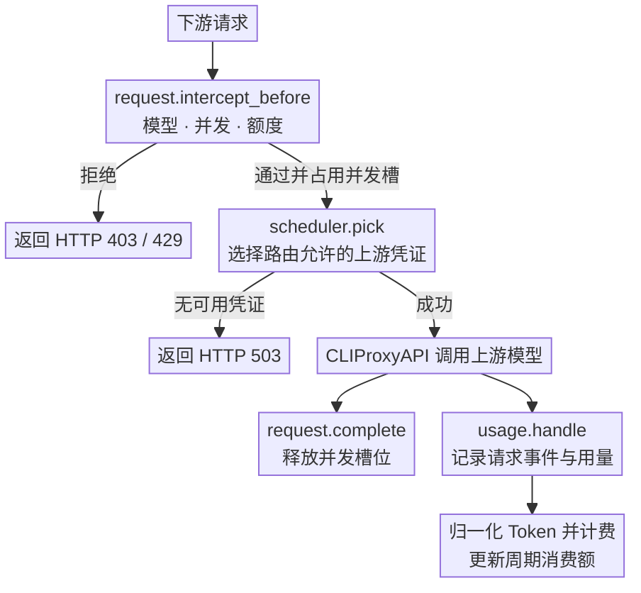
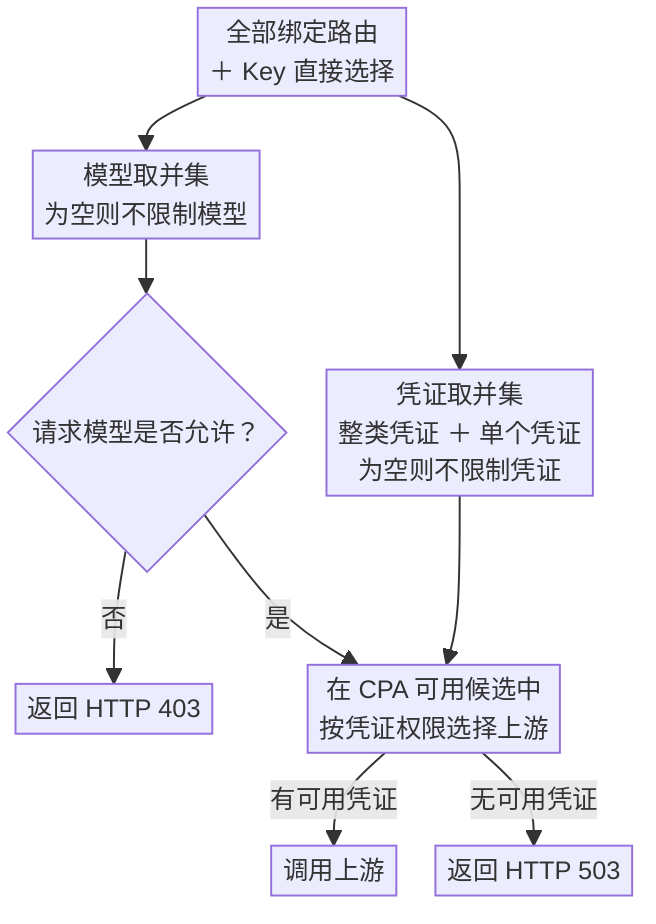

<div align="center">
  <h1>CPA Key Billing</h1>
  <p><strong><a href="https://github.com/router-for-me/CLIProxyAPI">CLIProxyAPI</a> 下游 API Key 计费与订阅额度插件。</strong></p>
  <p>
    <a href="https://github.com/haowang02/cpa-plugin-key-billing/releases/latest"></a>
    <a href="https://github.com/haowang02/cpa-plugin-key-billing/actions/workflows/check.yml"></a>
    
    <a href="./LICENSE"></a>
  </p>
</div>


## 功能特性

- 支持金额、Token、请求三种额度及定期重置，每个 API Key 独立计时
- 支持滚动周期和锚定周期，可让多个 API Key 对齐到同一周起点
- 支持按输入 Token 阈值切换长上下文**阶梯计价**
- 支持按 API Key 设置**最大并发请求数**
- 支持为每个 API Key 绑定**路由规则**，限制模型访问范围和上游凭证
- 可从 [models.dev](https://models.dev/) 获取模型参考价

## 工作原理

插件会在请求到达上游前检查订阅额度、并发和路由。上游调用结束后，CLIProxyAPI 通过 `usage.handle` 提供用量。插件据此记录请求事件、计算费用并更新周期消费额。



性能方面，插件以同步 RPC 方法接入 CLIProxyAPI 的请求链路。请求准入与凭证调度仅执行本地状态查询和规则计算，不进行网络 I/O，也不复制或解析上游响应；用量记录与计费则在上游调用结束后通过 `usage.handle` 完成。插件不创建后台协程、定时器或异步刷新任务，整体资源占用较少；请求链路上的额外开销仅来自轻量的本地判断，对请求延迟几乎没有影响。

## 环境要求

- CLIProxyAPI `7.2.143` 或更高版本，建议使用最新版本
- 使用支持插件的 CLIProxyAPI 构建，不要使用 no-plugin 版本

## 安装

在 CLIProxyAPI 根目录运行。macOS 和 Linux 使用：

```sh
curl -LsSf https://raw.githubusercontent.com/haowang02/cpa-plugin-key-billing/main/install.sh | sh
```

Windows 请先停止 CLIProxyAPI，再在 PowerShell 中运行：

```powershell
irm https://raw.githubusercontent.com/haowang02/cpa-plugin-key-billing/main/install.ps1 | iex
```

安装脚本会将插件安装到当前目录的 `plugins/`。安装或升级完成后需要重启 CLIProxyAPI。

也可以从 [Releases](../../releases/latest) 下载对应平台的发布包，解压后将动态库放入 CLIProxyAPI 的 `plugins/` 目录：

```text
plugins/cpa-key-billing.so       # Linux
plugins/cpa-key-billing.dylib    # macOS
plugins/cpa-key-billing.dll      # Windows
```

## 配置

在 CLIProxyAPI 配置文件中加入：

```yaml
plugins:
  enabled: true
  dir: "plugins"
  configs:
    cpa-key-billing:
      enabled: true
      debug: false # 是否记录 debug 日志，例如路由日志、匹配参考价日志
      codex_fast_mode_billing: false # 开启后，Codex 的 priority 请求按 2.5 倍计费
      state_file: "plugins/cpa-key-billing-state-v1.db"
```

`codex_fast_mode_billing` 开启后，请求 Codex 上游时在请求中指定 `service_tier=priority`，按普通费用的 **2.5 倍**结算。

> [!WARNING]
> 升级前请备份数据文件。
>
> - v1.0.0 至最新版本的数据库文件支持自动迁移。
> - v0.8.4 及更早版本的 JSON 或 SQLite 数据文件不支持迁移，请将 `state_file` 指向新文件。

重启 CLIProxyAPI 后，在管理中心打开「API Key 计费」。确认模型定价后，创建订阅计划并绑定需要限制的 API Key。

## 页面访问

管理员可以从 CLIProxyAPI 管理中心的「API Key 计费」菜单进入，也可以直接打开：

```text
http(s)://<CLIProxyAPI 地址>/v0/resource/plugins/cpa-key-billing/ui
```

普通用户使用自己的 API Key 查询订阅额度和用量时，直接打开：

```text
http(s)://<CLIProxyAPI 地址>/v0/resource/plugins/cpa-key-billing/ui#account
```

## 计费与订阅规则

- 未绑定订阅计划的 API Key 只统计用量，不限制额度。
- 订阅计划可设置多个自定义额度窗口，每个窗口可单独或组合限制金额、Token、请求数。
- 默认使用滚动周期：每个 API Key 独立记账，各周期从首次放行开始。
- 锚定周期可设置固定起点；所有绑定 API Key 共享同一组周期边界。例如，设置 `cycle_mode: anchored`、`anchor_at: 2026-09-14T00:00:00+08:00` 和 `period_seconds: 604800`，即可在东八区每周固定时刻重置。锚定起点之前的请求会被拒绝。
- 自定义价优先于 models.dev 参考价，两者都没有时拒绝新请求。
- 请求事件保留最近 365 天。

## 路由规则

在 API Key 页面绑定路由规则，也可直接选择模型、整类凭证或单个凭证。模型与凭证独立取并集，互不绑定；只有合并后的集合为空时，对应维度才不受限制。



## 拦截请求的响应

| 场景 | 状态码 | `type` | `code` |
| --- | --- | --- | --- |
| API Key 并发已满 | `429` | `rate_limit_error` | `rate_limit_exceeded` |
| 订阅额度用尽 | `429` | `rate_limit_error` | `rate_limit_exceeded` |
| 模型无权访问 | `403` | `permission_error` | `insufficient_quota` |
| 没有符合规则且可用的凭证 | `503` | `server_error` | `internal_server_error` |
| 已绑定的路由规则不存在或损坏 | `503` | `server_error` | `routing_configuration_error` |
| 模型未定价 | `503` | `cpa_key_billing_error` | `model_price_error` |

## 致谢

- [LINUX DO](https://linux.do/) - 新的理想型社区
